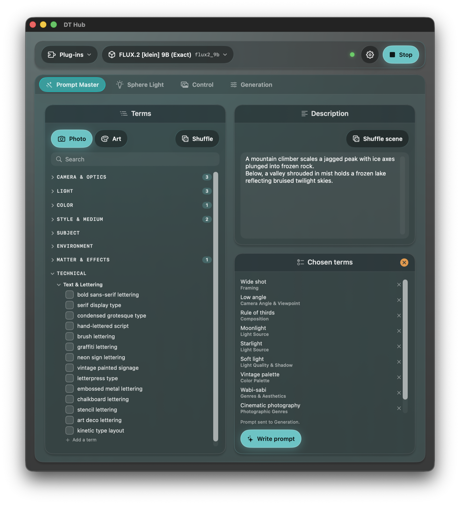
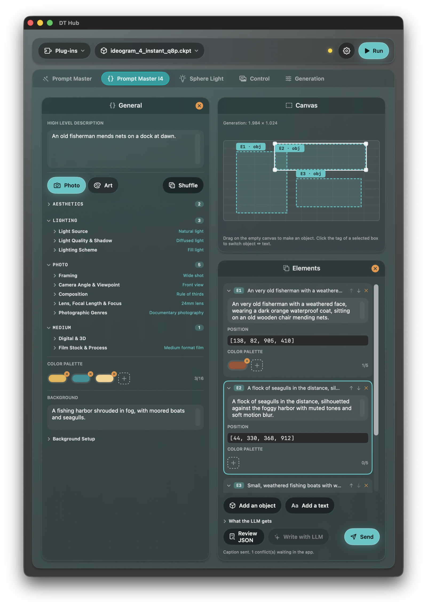
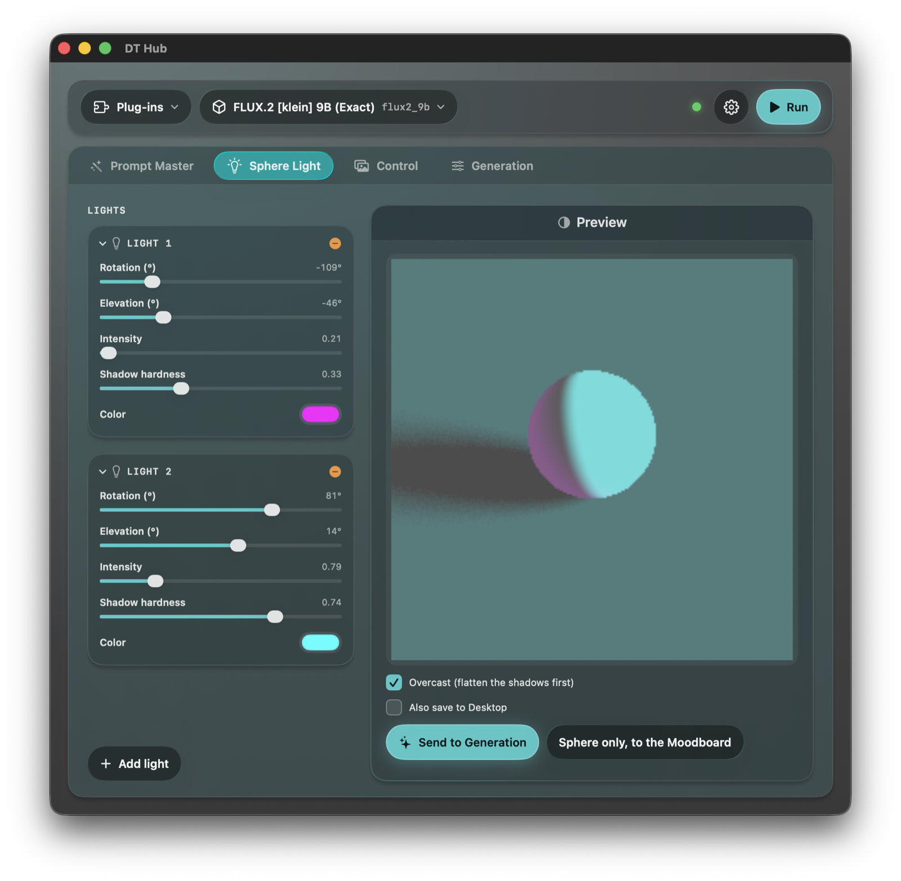
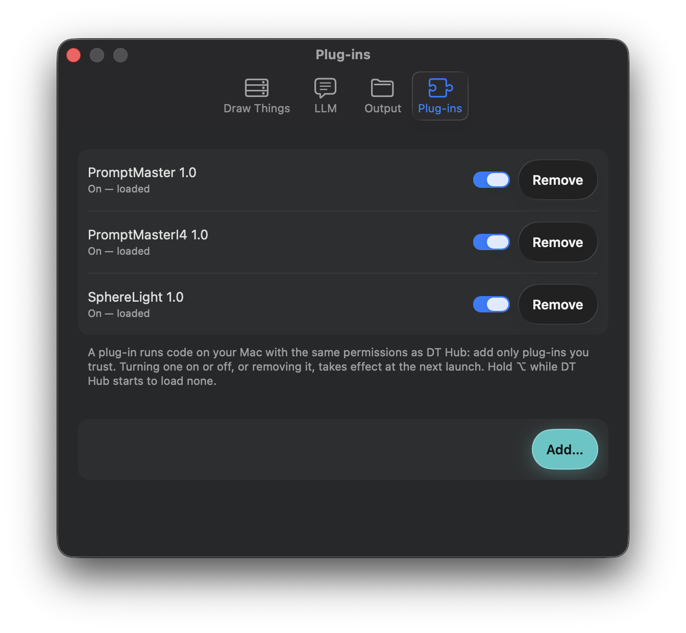

# DT Hub plug-ins

Six plug-ins ship in this repository. Each is a Swift package of its own, with its own tests and its own README. Prompt Master, Prompt Master I4, Sphere Light, Batch plus and LLM Chat keep their state per project.
A plug-in only works with the model families it was made for: on any other family it is **switched off and its tab is hidden**,
so the tab bar only ever shows what can be used with the model you picked.

| Plug-in | Works with | What it does |
| --- | --- | --- |
| **[Prompt Master](PromptMaster/README.md)** | FLUX.1, FLUX.2 (dev, klein 9B, klein 4B), Krea 2, Qwen Image, Qwen Image 2.1, Z Image, Stable Diffusion XL (and Pony / Illustrious), Stable Diffusion 1.5, ERNIE-Image, HiDream-I1, Anima (Cosmos 2.5): **13 families** | A database of 875 curated terms (8 groups, 40 categories: photography, light, colour, style, matter) that you pick with checkboxes, plus a free description in any language. *Write prompt* sends everything to the app's local LLM together with the master prompt of the selected model family, and the English prompt that comes back is written into the Generation tab (and into the negative prompt, for families that read one). Includes Shuffle and Shuffle scene. |
| **[Prompt Master I4](PromptMasterI4/README.md)** | **Ideogram 4** only | Composes the fixed-order JSON caption the model was trained on. Pick terms from the database, write the texts, and place objects and lettering on a canvas with their boxes and colours; the JSON is previewed live, and the LLM can write the descriptions for you. |
| **[Sphere Light Reference](SphereLight/README.md)** | The **FLUX.2 [klein]** family (**9B** recommended, better results; 4B works too), with the [Sun Direction LoRA](https://huggingface.co/eric-venti-seeds/Sun-Direction-Lora-Flux2Klein9B) | Place lights on a sphere, render it (CPU ray tracing) and send it to Draw Things so the light, the colours and the sun direction of an image match the sphere. **Multiple and coloured lights are exclusive to this plug-in**: it pushes the LoRA beyond its original limits. |
| **[Character Sheet](CharacterSheet/README.md)** | **Qwen Image 2.1** only | Prepares a character design sheet from one picture: a base sheet (views, poses, silhouettes, expressions, details), a 4×3 expressions sheet or a 5×2 poses sheet. The picture goes to the Moodboard, the canvas is set and the prompt is written, either from a static prompt or by a local vision model (Qwen3-VL, or Qwen's PE I2I prompt enhancer). **Based on [NeuroContent's workflow](https://civitai.com/models/2960750/qwen-image-21-character-design-sheet-maker-workflow?modelVersionId=3377047).** |
| **[Batch plus](BatchPlus/README.md)** | **All families** | Prepares a series of consecutive RUNs and sends it as a pipeline: either numeric parameters that grow by an increment (steps, guidance, shift, CFG-Zero\* initial steps, seed, LoRA weights, varying together) or a bulleted list of prompts, one pass each. |
| **[LLM Chat](LLMChat/README.md)** | **All families** | Chat with a local LLM about the prompt and the settings; it can describe the start image and the Moodboard pictures. With the `<SEND>` command it writes the prompt, the parameters, the strength or a pipeline into the Generation tab (you always press Run yourself). Chats are kept per project. Needs DT Hub 0.1.6 or later. |

  
  
  

## Install

Every [release](https://github.com/EXistenz-78/dt-hub/releases/latest) carries the six plug-ins. Download the one you want, unzip it (you get a `.dthubplugin` bundle):

- [Prompt Master](https://github.com/EXistenz-78/dt-hub/releases/latest/download/PromptMaster.dthubplugin.zip)
- [Prompt Master I4](https://github.com/EXistenz-78/dt-hub/releases/latest/download/PromptMasterI4.dthubplugin.zip)
- [Sphere Light Reference](https://github.com/EXistenz-78/dt-hub/releases/latest/download/SphereLight.dthubplugin.zip)
- [Character Sheet](https://github.com/EXistenz-78/dt-hub/releases/latest/download/CharacterSheet.dthubplugin.zip)
- [Batch plus](https://github.com/EXistenz-78/dt-hub/releases/latest/download/BatchPlus.dthubplugin.zip)
- [LLM Chat](https://github.com/EXistenz-78/dt-hub/releases/latest/download/LLMChat.dthubplugin.zip)

Then, in DT Hub, open **Preferences › Plug-ins**, press **Add…**, pick the `.dthubplugin` bundle and restart the app (turning a
plug-in on or off, or removing it, takes effect at the next launch). Each plug-in then appears as a tab, and can be switched on and off
there or from the plug-in menu in the header.

A plug-in runs code on your Mac with the same permissions as DT Hub: add only plug-ins you trust. The bundles are ad-hoc signed; if
macOS reports one as blocked, clear its quarantine flag with `xattr -dr com.apple.quarantine <the .dthubplugin>` and add it again.

## Build a plug-in bundle yourself

Each plug-in has a `Scripts/build.sh` that makes the bundle. For example, for Prompt Master I4:

    Plugins/PromptMasterI4/Scripts/build.sh "$TMPDIR/pm-i4"

The bundle is `$TMPDIR/pm-i4/PromptMasterI4.dthubplugin`: add it from Preferences as above. As an alternative to the Add… button, put it
into `~/Library/Application Support/DT Hub/Plug-ins/` with the bundle identifier as its name, replacing any older version (remove it first:
`cp -R` onto an existing folder would copy *inside* it), and restart DT Hub:

    D="$HOME/Library/Application Support/DT Hub/Plug-ins/com.exiztenz.dthub.promptmasteri4.dthubplugin"
    rm -rf "$D" && cp -R "$TMPDIR/pm-i4/PromptMasterI4.dthubplugin" "$D"

Run a plug-in's tests from its folder: `cd Plugins/PromptMasterI4 && swift test`.

## Writing your own

See [`../PluginKit/README.md`](../PluginKit/README.md): the contract between the app and a plug-in, the messages (`context`, `contribute`,
`llm`, `presets`…), a sample plug-in and the design system.
