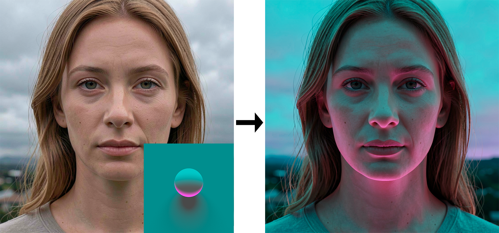

# Sphere Light Reference (SLR)

> **Works with:** the **FLUX.2 [klein]** family, with the [Sun Direction LoRA](https://huggingface.co/eric-venti-seeds/Sun-Direction-Lora-Flux2Klein9B) (`flux_2_sun_direction_lora_v1_lora_f16.ckpt`). The **9B** is recommended: it gives better results; the **4B** works too.
> On any other family the plug-in is switched off and its tab is hidden.

A DT Hub plug-in: it places up to three lights on a sphere, renders it (CPU ray tracing) and sends it to Draw Things so that the
light, the colours and the sun direction of an image match those of the sphere.

**Multiple and coloured lights are exclusive to this plug-in.** SLR pushes the LoRA beyond its original limits: the reference
sphere can be lit by several lights at once, each with its own colour, rotation, elevation, intensity and shadow hardness.

A reference picture with the sphere in its corner (left), and what the model made of it (right): the cyan and pink lights of the
sphere now fall on the face and the scene.

- **Send to Generation:** the sphere goes to the Moodboard and the Run button becomes a preset pipeline: `SLR · Match the sun`,
  preceded by `SLR · Overcast` (it flattens the shadows of the canvas) if the "Overcast" box is on.
- **Sphere only, to the Moodboard:** sends just the image, so you can use your own prompt and parameters.
- **The presets** register themselves when the plug-in is activated and live in the Presets menu: you can change them (the LoRA
  weight, the steps…) and save them under the same name; the plug-in never overwrites them. If you delete one, "Send to
  Generation" recreates it.
- **Also save to Desktop:** a copy of the sphere as `Sphere Light NNN.png`.

The tab uses the app's own components (`DTHubDesign`, from the `PluginKit` package): cards, pill buttons, teal checkboxes.

## Projects

The tab keeps its state **per project**: when you open another project in DT Hub (the **Project** menu) the tab shows what that project had, and a new project starts from scratch. The state is `state.json` in the plug-in's own folder inside the project (`<output>/<project>/.dthub/plugins/`). The first project you make adopts the state the tab had before projects existed.

## Install and build

Add the `.dthubplugin` bundle in DT Hub › Preferences › Plug-ins (**Add…**, or drag the file in), then restart the app. To build
the bundle yourself:

    Plugins/SphereLight/Scripts/build.sh OUT_FOLDER     # makes OUT_FOLDER/SphereLight.dthubplugin
    cd Plugins/SphereLight && swift test                # the plug-in's tests

The renderer's code comes from the standalone `LightDirectionApp` (a copy: the standalone app is no longer developed).
