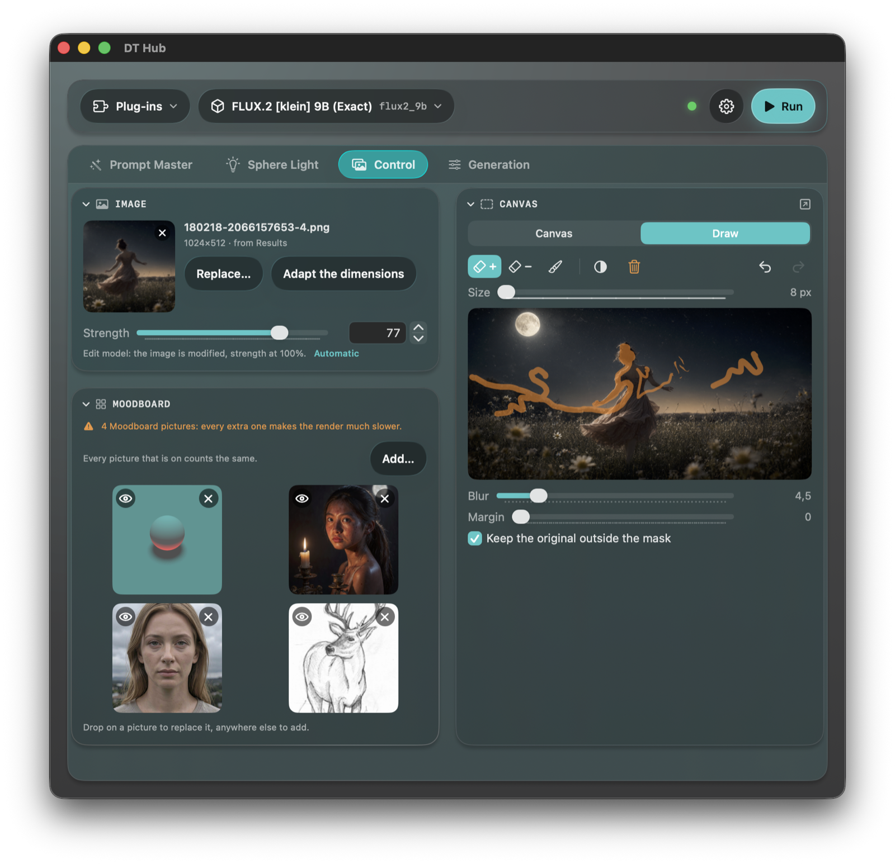
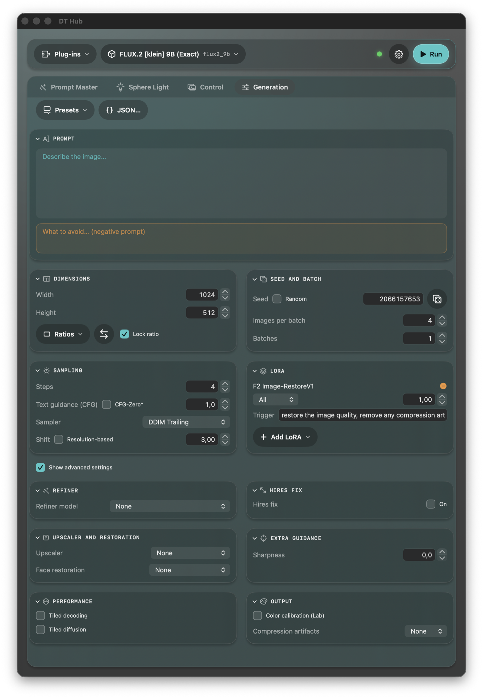
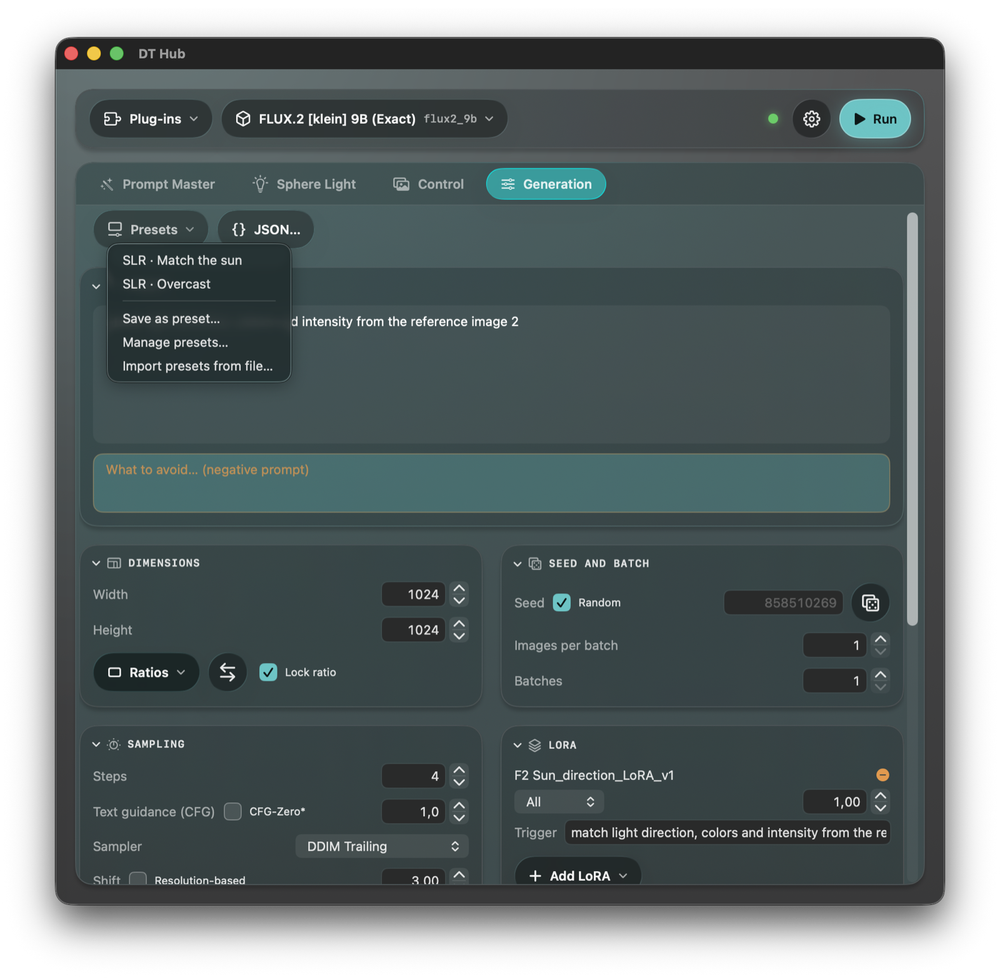
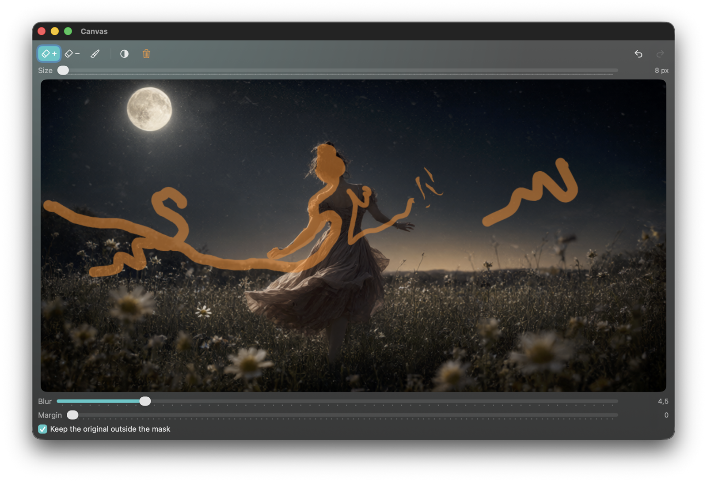
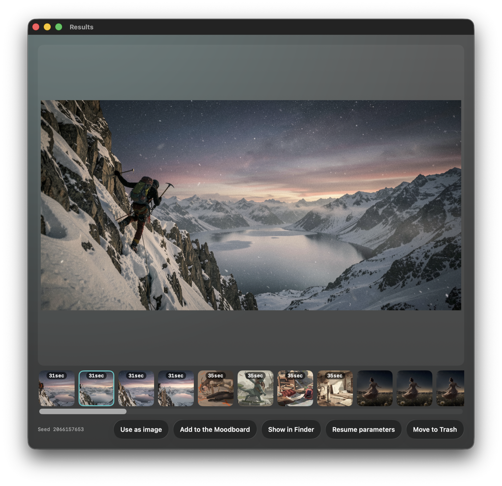
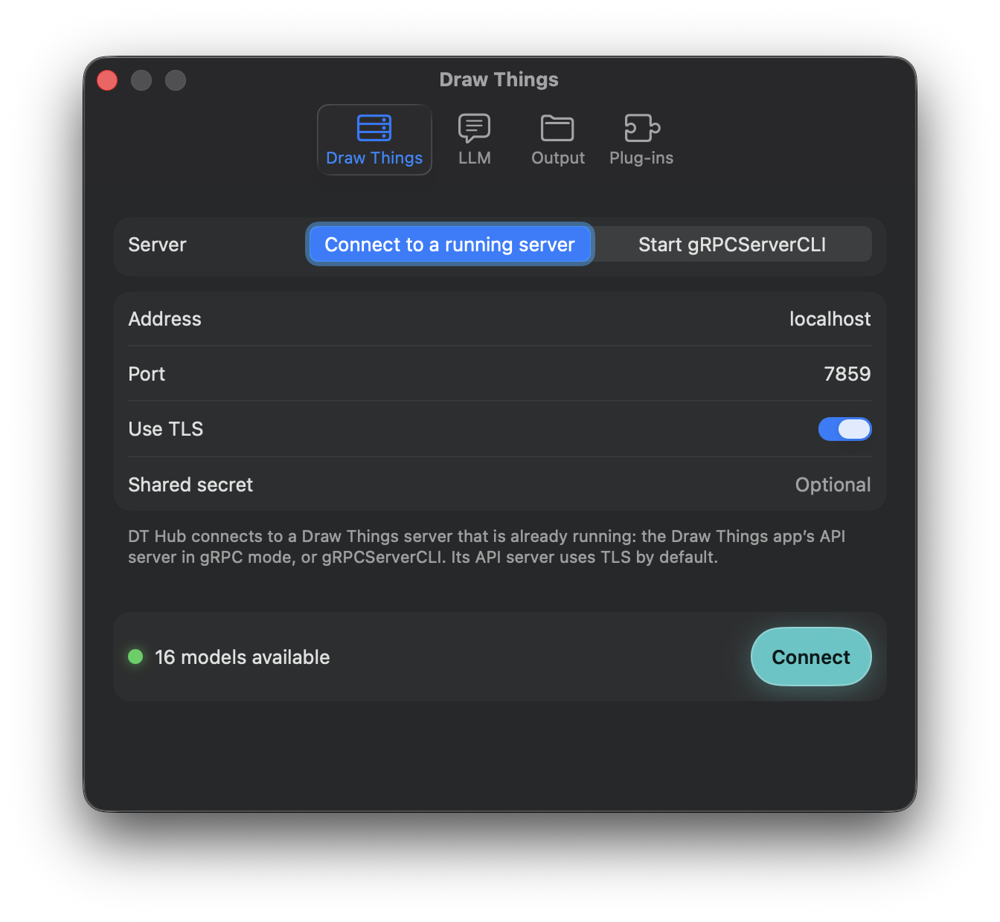
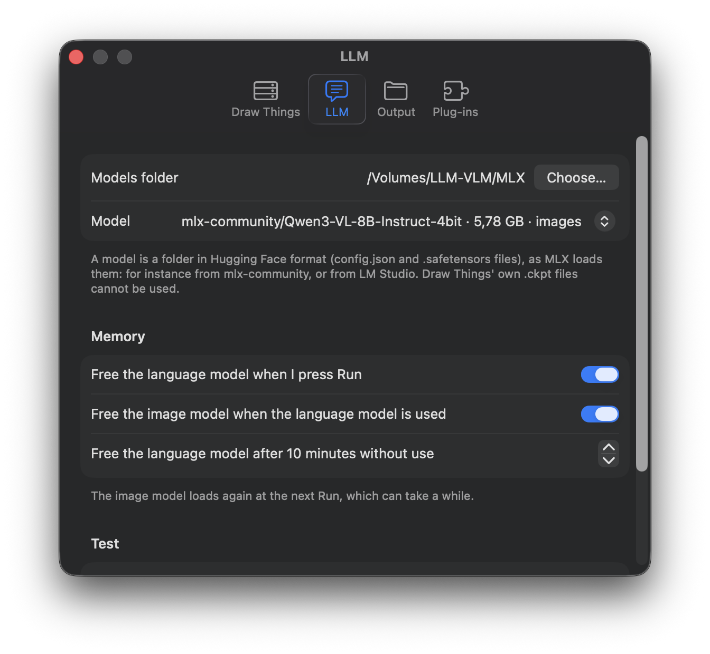

# DT Hub

A native macOS companion for [Draw Things](https://drawthings.ai/): a dedicated workspace for **preparing and launching image generations**. DT Hub connects to the Draw Things gRPC server, which does all the rendering, and adds what sits around it: inputs you can always see, a canvas you can draw on from an iPad, a local LLM that writes and improves prompts, and plug-ins that each bring their own tab.

This is an independent community project, not affiliated with or endorsed by Draw Things Technologies. It started as a personal tool and is published as open source under the GPL-3.0.

## What DT Hub adds

- **Canvas on your iPad.** The Canvas card opens in a window of its own that shows nothing but the drawing, as large as the window allows. Move it to an iPad connected with **Sidecar** and paint the inpainting mask, or draw in colour onto the image, with an **Apple Pencil** or your fingers. Undo and redo keep working in the window.
- **Image and Moodboard always in sight.** The Control tab shows the start image, the Moodboard and the Canvas side by side, never behind a menu: every Moodboard picture can be switched on or off with its eye, and you drag pictures in from the Results strip, the Finder or the clipboard.
- **A lock on the canvas proportions.** Width and height follow the ratio you choose: *Lock ratio* keeps it while you type or step either value, and the Ratios menu and the swap button change it in one click.
- **Everything you made, at hand.** The Results window keeps the images of the session (and brings back the last ones after a restart); each thumbnail shows **how many seconds it took**, can be dragged anywhere, and offers *Use as image*, *Add to Moodboard*, *Show in Finder*, *Resume parameters* and *Trash*. Every PNG is saved with its prompt, its whole configuration and the time it took inside the file.
- **Presets and preset pipelines.** Save a configuration as a preset and chain several presets into one Run. Recommended settings per model family are suggested for you.
- **A local LLM (MLX)** that runs inside the app and can see images, with controls to free memory so the image model and the LLM can share a Mac. Nothing is downloaded unless you ask for it.
- **Prompt tools.** *Enhance Prompt* rewrites your prompt for the selected model's family and *Generate Prompt* writes one from the start image, both with the local language model.
- **Plug-ins**, each with its own tab and active only on the model families it was made for: Prompt Master, Prompt Master I4 (Ideogram 4), Sphere Light Reference and Character Sheet (Qwen Image 2.1). See [`Plugins/`](Plugins/README.md).
- **Keyboard.** ⌘↩ Run, ⌘. Stop, ⌘R Results, ⌃Page Up / ⌃Page Down to step through the tabs.
- **Managed server.** DT Hub can start Draw Things' `gRPCServerCLI` by itself, or connect to the server of the Draw Things app.

## A look around

**Generation.** The prompt (with the negative prompt, shown only for the families that use it) and collapsible cards for dimensions, sampling, seed and batch, LoRAs and an advanced section. Every value can be typed or stepped, the open or closed state of each card is remembered, and a JSON editor shows and edits the whole configuration.

**Presets.** Save a configuration as a preset, import and manage them, and let a plug-in register its own: Sphere Light's two presets, for example, are chained into one Run.

**Canvas window.** Only the drawing, for the Pencil.

**Results.** Live preview while generating, then the image; the strip shows the seconds each picture took.

**Preferences.** The Draw Things server, the local LLM and its memory behaviour, the output folder and the plug-ins.

  
  
  

## Requirements

- macOS 26 and an Apple Silicon Mac.
- A Draw Things gRPC server: the Draw Things app with its API server enabled, or the `gRPCServerCLI` binary, which DT Hub can start itself.
- To build: Xcode 27.

## Install

1. Download **`DT-Hub-0.1.1-macOS-arm64.zip`** from the [latest release](https://github.com/EXistenz-78/dt-hub/releases/latest).
2. Unzip it and drag **DT Hub.app** into `/Applications`.
3. Read **First launch** below before you open it.
4. Optional: add the plug-ins (they are in the same release, see [`Plugins/`](Plugins/README.md#install)).

You also need a Draw Things gRPC server (see Requirements).

## First launch (important)

The app is signed with an Apple Development certificate but it is **not notarized**, so macOS Gatekeeper refuses to open it the first time. This is expected, not a broken download.

When you see *"Apple could not verify 'DT Hub' is free of malware"*:

1. Open **System Settings › Privacy & Security**.
2. Scroll down: there is a line saying **"DT Hub" was blocked**.
3. Click **Open Anyway** and confirm in the dialog that appears.

You only need to do this once per download. If you would rather not trust a binary, build it yourself from source (below).

## Build from source

1. Install the Metal Toolchain once (MLX's shaders need it):

        xcodebuild -downloadComponent MetalToolchain

2. Open `DTHub.xcodeproj` in Xcode and run the **DTHub** scheme, or from a terminal:

        xcodebuild -project DTHub.xcodeproj -scheme DTHub -destination 'platform=macOS' build

3. The logic lives in Swift packages: run its tests from `Packages/`:

        cd Packages && swift test

   Each plug-in is a package of its own, with its own tests (`cd Plugins/PromptMasterI4 && swift test`).

## The local LLM

DT Hub looks for MLX models (Hugging Face format: a folder with `config.json` and `.safetensors` files) in the folder you choose in **Preferences › LLM**. The recommended model is `mlx-community/Qwen3-VL-8B-Instruct-4bit` (about 5.8 GB, Apache-2.0); the Preferences can download it, but only when you ask and after a dialog that names the repository, the size and the destination. The same pane has a test question, with or without an image.

## Plug-ins

A plug-in is a bundle (`.dthubplugin`) with a dynamic library, loaded into the app and shown as a tab. You add one in **Preferences › Plug-ins**. A plug-in only works with the model families it was made for: on any other family it is switched off and its tab is hidden. The four plug-ins in this repository, which families each one works with, and how to build and install them are described in [`Plugins/README.md`](Plugins/README.md). To write your own, start from [`PluginKit/README.md`](PluginKit/README.md): the app and a plug-in talk only through Objective-C selectors and JSON messages, and the kit includes the design system so a plug-in tab looks like the rest of the app.

## Languages

The interface of the app and of the plug-ins is available in **English and Italian** and follows the language of macOS. The design documents in [`docs/superpowers/`](docs/superpowers/) (specs and plans) are written in Italian.

## Repository layout

| Folder | What is in it |
| --- | --- |
| `App/` | The app: connection, controls, generation, main window, plug-in host, preferences, results. |
| `Packages/` | The logic (`HubCore`, `HubKit`, `DTBridge`, `LLMBridge`, `PluginHost`) and its tests. |
| `PluginKit/` | The kit and the design system a plug-in is written with; contract 1 of the plug-ins. |
| `Plugins/` | Prompt Master, Prompt Master I4, Sphere Light Reference and Character Sheet. |
| `docs/superpowers/` | Specs and plans (in Italian). |

## Status

An early version (0.1.1), used daily by its author. Feedback, bug reports and ideas are welcome: open an [Issue](../../issues).

## License

[GPL-3.0](LICENSE).
